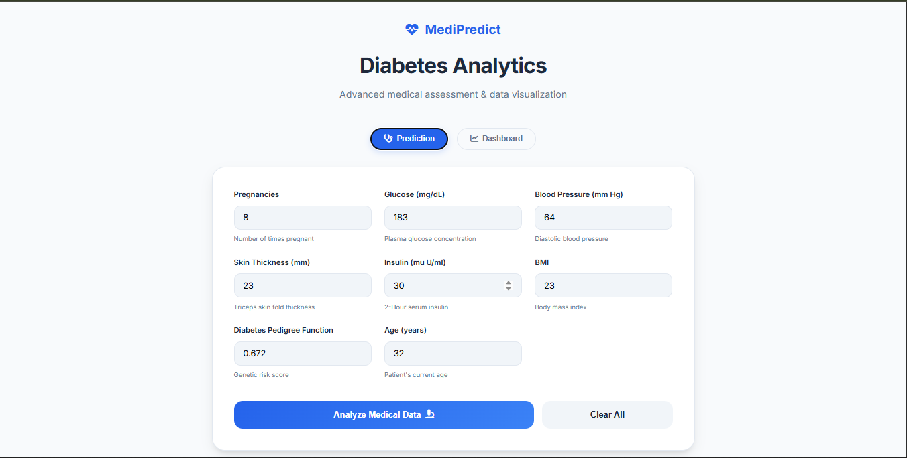
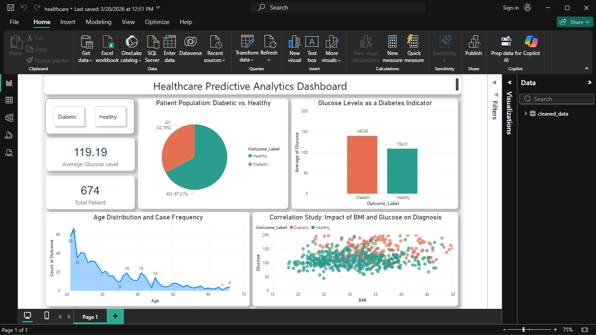
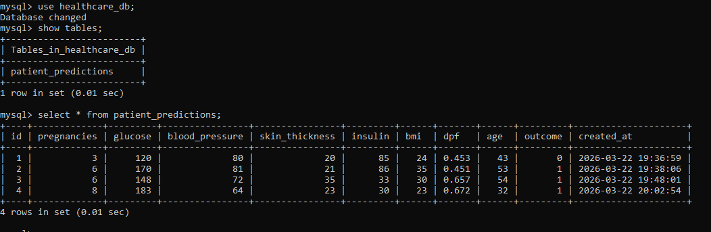

# 🩺 MediPredict – Healthcare Predictive Analytics System

A full-stack machine learning application that predicts diabetes risk and provides real-time analytics through an interactive dashboard. The system is deployed on AWS using Docker for scalable and consistent execution.

---

## 🚀 Project Overview

MediPredict is an end-to-end healthcare analytics system that integrates:

* Machine Learning for disease prediction
* Web development for user interaction
* Data visualization for insights
* Cloud deployment for real-world accessibility

---

## 🌟 Key Features

### 🤖 AI Prediction Engine

* Logistic Regression model trained on healthcare dataset
* Real-time predictions via Flask API
* Probability-based classification with optimized threshold

### 📊 Analytics Dashboard

* Built using Power BI
* Visualizes:

  * Patient distribution (Diabetic vs Healthy)
  * Glucose level trends
  * Age distribution
  * BMI vs Glucose correlation

### 🗄️ Database Integration

* Stores:

  * Patient input
  * Prediction results
  * Timestamp

### 🌐 Web Application

* Flask-based backend
* HTML/CSS frontend
* Interactive UI for prediction

### ☁️ Cloud Deployment

* Deployed on AWS EC2
* Containerized using Docker
* Publicly accessible via EC2 public IP

---

## 🏗️ System Architecture

```id="arch1"
User → Web UI → Flask API → ML Model → Prediction → Database → Dashboard
                         ↓
                      Docker Container
                         ↓
                    AWS EC2 Server
```

---

## 🛠️ Tech Stack

### 🔹 Machine Learning

* Python
* Scikit-learn
* Pandas, NumPy

### 🔹 Backend

* Flask

### 🔹 Frontend

* HTML, CSS, JavaScript

### 🔹 Visualization

* Power BI

### 🔹 Database

* MySQL (optional / implemented if applicable)

### 🔹 DevOps

* Docker
* AWS EC2
* Git & GitHub

---

## 📊 Machine Learning Details

* Model: Logistic Regression
* Problem Type: Binary Classification
* Target: Diabetes (0 = No, 1 = Yes)

### ✔ Key Improvements

* Handled missing values (0 → median)
* Feature scaling using StandardScaler
* Threshold tuning to improve recall

### 📈 Model Performance

| Metric    | Value |
| --------- | ----- |
| Accuracy  | ~76%  |
| Precision | ~59%  |
| Recall    | ~77%  |
| F1 Score  | ~0.66 |
| AUC       | ~0.86 |

---

## 📸 Project Screenshots

### 🔹 Power BI Dashboard



### 🔹 Database Records



---

## 📂 Project Structure

```id="arch2"
MediPredict/
│
├── app.py
├── Dockerfile
├── requirements.txt
├── modelForPrediction.pickle
├── standardScalar.pickle
├── diabetes.csv
├── cleaned_diabetes_data.csv
│
├── templates/
├── static/
├── screenshots/
│
└── notebooks/
```

---

## ⚙️ Setup Instructions (Local)

### 1️⃣ Clone Repository

```bash id="cmd1"
git clone <your-repo-link>
cd MediPredict
```

---

### 2️⃣ Create Virtual Environment

```bash id="cmd2"
python -m venv venv
venv\Scripts\activate
```

---

### 3️⃣ Install Dependencies

```bash id="cmd3"
pip install -r requirements.txt
```

---

### 4️⃣ Run Application

```bash id="cmd4"
python app.py
```

Open:

```id="cmd5"
http://127.0.0.1:5000/
```

---

## 🐳 Docker Deployment

### Build Docker Image

```bash id="cmd6"
docker build -t medipredict .
```

### Run Container

```bash id="cmd7"
docker run -d -p 5000:5000 medipredict
```

---

## ☁️ AWS Deployment (EC2)

* Launched EC2 instance (Ubuntu, t2.micro)
* Installed Docker
* Cloned repository
* Built and ran Docker container
* Exposed port 5000

Access app via:

```id="cmd8"
http://<EC2-Public-IP>:5000
```

---

## 🧠 Key Insights

* High glucose strongly correlates with diabetes
* BMI > 30 significantly increases risk
* Age contributes to risk but is not a sole factor
* Combined features improve prediction accuracy

---

## 👥 Team Members

* Ajit Bhandekar
* Harsh Palkrutwar
* Dhanesh Thite

---

## 🎯 Future Improvements

* Multi-disease prediction system
* Model improvement (Random Forest, XGBoost)
* Authentication system
* Domain + HTTPS deployment

---

## 📌 Conclusion

MediPredict demonstrates a complete machine learning pipeline integrated with web technologies, cloud deployment, and data analytics — forming a real-world healthcare decision support system.

---

## ⭐ Support

If you like this project, give it a ⭐ on GitHub!
